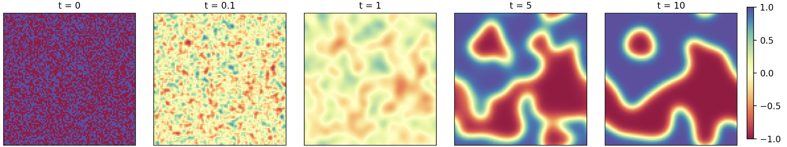

# Numerical Solution of the Allen-Cahn Equation in Two Dimensions by Crank-Nicolson/Adams-Bashforth Finite Difference Scheme
### By Hussam Althunayyan & Cameron MacKenzie

$$ \partial_tu-\varepsilon^2\nabla^2 u=u-u^3 $$

